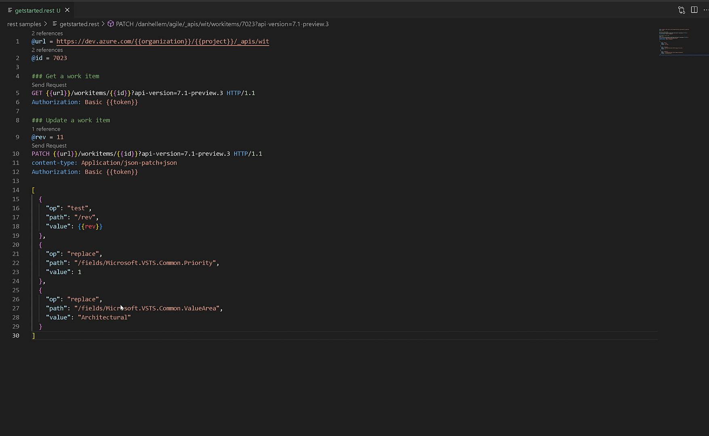

# Samples to update and create work items in batch

## Getting Started

- Get [Visual Studio Code](https://code.visualstudio.com/)
- [Create Azure DevOps Personal Access Token](#personal-access-token)
- [Install REST Client extension](#rest-client)
- [Configure Settings.json with environment variables](#settingsjson)

### Personal Access Token

You will need to create a Personal Access Token. For the work item batch API's, it appears you need a full scoped PAT. 

You then need to Base64Encode the `{username}:{personalaccesstoken}` before it can be used by the REST Client. You can store this value locally in the VS Code Settings.json file.

### REST Client

#### Download and install extension

Download the [REST Client](https://marketplace.visualstudio.com/items?itemName=humao.rest-client) extension for Visual Studio Code

#### Settings.json

Add the following entries to the REST Client environment variables. These variables are used throughout the samples. You can also hardcode the values if that is preferred.

```json
 "rest-client.environmentVariables": {
        "$shared": {
            "organization": "organization name",
            "project": "project name",
            "token": "base64encoded username:personalaccesstoken"
        }
    }
```
## Current Samples

 - [Getting started with a simple get and update work item](rest%20samples/getstarted.rest)
 - [Update fields on two work items](rest%20samples/updatetwoworkitems.rest)
 - [Update work item and create a new work item](rest%20samples/updateandcreate.rest)

## Running Samples

Some of the indivual calls will need values modified. Revision and work item id for example. Otherwise you just open a `.rest` file and run the request.

 

